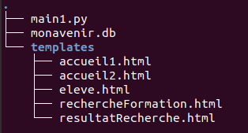
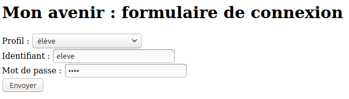
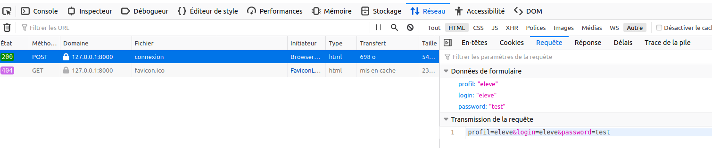
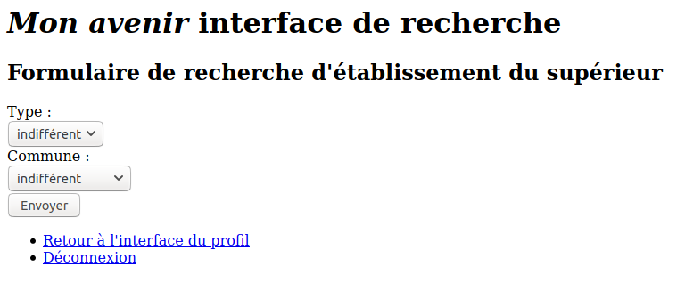
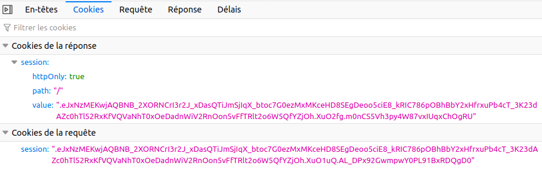

---
title : Projet "Mon avenir", étape 4 
author : Véronique Reynaud, Brigitte Mougeot, Frédéric Junier
numbersections: true
fontsize: 11pt
geometry:
- top=20mm
- left=20mm
- right=20mm
- heightrounded    
--- 
 


[URL]: https://developer.mozilla.org/fr/docs/Glossaire/URL

[HTTP]: https://developer.mozilla.org/fr/docs/Glossaire/HTTP

[HTML]: https://developer.mozilla.org/fr/docs/Glossaire/HTML


[CSS]: https://developer.mozilla.org/fr/docs/Glossaire/CSS

[SQL]: https://www.w3schools.com/sql/


[HTTPS]: https://developer.mozilla.org/fr/docs/Glossaire/https

[TCP]: https://developer.mozilla.org/fr/docs/Glossaire/TCP

[Python]: https://docs.python.org/3.7/library/cgi.html

[POST]: https://developer.mozilla.org/fr/docs/Web/HTTP/M%C3%A9thode/POST

[GET]: https://developer.mozilla.org/fr/docs/Web/HTTP/M%C3%A9thode/GET

[Sqlite]: https://www.sqlitetutorial.net/

[Flask]: https://flask.palletsprojects.com/en/1.1.x/

[Framework]: https://fr.wikipedia.org/wiki/Framework

[MVC]: https://developer.mozilla.org/fr/docs/Glossaire/MVC

[Jinja]: https://jinja.palletsprojects.com/en/2.11.x/

[Thonny]: https://thonny.org/

[Spyder]: https://www.spyder-ide.org/

[Notepad++]: https://notepad-plus-plus.org/

[sqlite3]: https://docs.python.org/3/library/sqlite3.html

[sqlitebrowser]: ]https://sqlitebrowser.org/

[Netscape]: https://fr.wikipedia.org/wiki/Netscape_Navigator

# Développement Web côté serveur en Python

## Exercice 1 : découverte de [Flask][Flask]

[Flask][Flask] est un micro [Framework][Framework] permettant de développer des applications Web en [Python][Python]. Il impose peu de choix  prédéfinis au programmeur.

En appui ou en complément, on pourra utiliser les ressources en ligne suivantes :

* une activité de David Roche autour de [Flask][Flask] construite pour des élèves de première NSI
* la documentation officielle de [Flask][Flask]   sur [https://flask.palletsprojects.com/en/1.1.x/](https://flask.palletsprojects.com/en/1.1.x/)

1. Récupérer l'archive `materiel.zip` et l'extraire. L'arboresence du dossier `materiel` doit être semblable à celle-ci :

\


2. Éditer le fichier `main_exo1.py` dans un environnement de programmation en [Python] tel que [Thonny] ou [Spyder]. Le contenu du fichier est reproduit ci-dessous :

--------------

   ~~~python
   from flask import *  #module pour developper une application web
   import sqlite3       #module pour interagir avec une base de donnees sqlite
   import datetime      #module de gestion des dates

   #création d'une instance de l'application
   app = Flask(__name__)


   @app.route('/')
   def accueil():
      "Controleur de la  route '/'"
      date = datetime.datetime.now()
      h = date.hour
      m = date.minute
      s = date.second
      return "<p>Bonjour il est {} heures {} minutes et {} secondes.</p>".format(h, m, s)

   # on ouvre un serveur en local sur le port 8000
   app.run(host='127.0.0.1', port=8000)
   ~~~

-------------

3. Éxécuter ce script [Python]. Dans la console, on devrait obtenir un affichage d’une dizaine de lignes :

   ```
   * Serving Flask app "main_exo1" (lazy loading)
   * Environment: production
      WARNING: Do not use the development server in a production environment.
      Use a production WSGI server instead.
   * Debug mode: on
   * Running on http://127.0.0.1:8000/ (Press CTRL+C to quit)
   * Restarting with stat
   * Debugger is active!
   * Debugger PIN: 266-323-620
   ``` 

   * __Question a)__ L'application [Flask][Flask], portant  le nom  du script,  a lancé un serveur Web dont l'adresse [IP][IP] est  ......... (boucle locale) et le port [TCP][TCP]   est ...........
   * __Question a)__ Quel est le protocole de la couche application qui est utilisé lors d'un échange entre un client et un serveur Web ? Où sont situés le serveur et le client si on veut tester l'application ?
   * __Question c)__ D'après le code de l'application, si  on ouvre  un navigateur Web comme Firefox et si on saisit l'[URL][URL] `http://127.0.0.1:8000/` dans la barre d'adresse, quel affichage devrait-on obtenir ? 
   * __Question d)__ Attendre quelques instants et rafraîchir la page. Que remarque-t-on ? Comment peut-on qualifier ce type de page Web ?

4. La fonction `accueil` est préfixée par l'instruction  `@app.route('/')`, qui est un _décorateur_.  Si l'[URL][URL] se termine par `/`, la fonction `accueil` est appelée et retourne un code [HTML][HTML] après l'avoir formaté avec des paramètres  de temps en heures, minutes et secondes. On parle de __contrôleur de route__  ( `view` dans la terminologie de [Flask][Flask]).
Néanmoins, il serait préférable de retourner une page Web complète en respectant la structure d'un document en [HTML][HTML]. 
[Flask][Flask] propose une fonction `render_template` qui permet de retourner une page [HTML][HTML] complète. Le terme _template_ signifie que la page peut être paramétrée, comme nous le verrons plus tard. 
Attenion, tous les fichiers [HTML][HTML], doivent se trouver dans le sous-répertoire `templates`  du répertoire  `matériel`.


   * __Question a)__  Dans la console, arrêter le serveur avec la séquence clavier `CTRL + C`. Revenir sur la page [HTML][HTML] et rafraîchir/
   * __Question b)__ Dans le code de la fonction `accueil`, remplacer `"accueil1.html"` par `"acc.html"`, enregister sans relancer le serveur. Rafraîhir la page, que se passe-t-il ? Fermer puis relancer le serveur. Quel message d'erreur s'affiche ? Dans la barre d'outils de développement du navigateur (F12), récupérer le code d'erreur [HTTP][HTTP]. Quelle différence avec la célèbre erreur 404 ? Rectifier le nom du _template_ puis rafraîchir la page sans arrêter le serveur. La modification est-elle prise en compte ?
   * __Question c)__  Arrêter le serveur  et activer le mode débogagge avec le paramètre d'éxécution `debug = True` dans  la ligne `app.run(debug=True, host='127.0.0.1', port=8000)`. Relancer le serveur et rafraîchir la page.  Reprendre la question b). Quel message d'erreur obtient-on désormais ? Rectifier le nom du _template_.  Est-il désormais nécessaire de relancer le serveur pour que   les modifications soient prises en compte ?

   __Remarque :__  En phase de développement, nous activerons toujours le mode débogagge.

5. Consulter avec un éditeur de textes, comme [Notepad++][Notepad++], le code du fichier  `accueil1.html`. 

-------------------
   ~~~html
   <!DOCTYPE html>
      <html lang="fr">
      <head>
      <title>Connexion </title>
      <meta charset="utf-8">
      </head>      
       <body>
         <p>Bonjour il est {{heure}} heures {{minute}} minutes et {{seconde}} secondes.</p>
      </body>
   ~~~
-----------------


   * __Question a)__ Compléter `render_template("accueil1.html", heure = h, minute = m, seconde = s)` est un appel de fonction avec deux types de ............ :
     * _positionnel_ :  ................
     * _nommés_ : ...................
     Ainsi, `render_template` affiche une page web en utilisant les valeurs des variables données en paramètre.  

6. Consulter avec un éditeur de textes, comme [Notepad++][Notepad++], le code du fichier `accueil1.html`. 
   * __Question a)__ Obtient-on le même affichage qu'avec l'application, si on ouvre  `accueil1.html` directement avec un navigateur Web ?
   * __Question b)__ Quelle syntaxe particulière permet d'insérer les valeurs de ces paramètres dans le fichier `accueil1.html` ?  Ce mécanisme est effectué par un moteur de template nommé [Jinja][Jinja], qui permet aussi d'insérer des structures de contrôle comme des tests ou des boucles pour paramétrer plus finement l'affichage du _template_.


## Exercice 2 : formulaire de connexion et base de données

L'objectif est de réaliser un formulaire de connexion dans  la  page d'accueil avec identifiant (`login`) et mot de passe (`password`). Le programme de traitement du formulaire doit vérifier l'existence du couple (`login`, `password`) dans la base de données `monavenir.db` fournie dans le dossier `materiel`.

__Cahier des charges :__

* Le formulaire en [HTML][HTML] dans un fichier `accueil2.html` placé dans le dossier `templates`,  aura trois champs :
  * un champ de sélection de profil : élève, lycée, admin, établissement du supérieur
  * un champ de saisie de `login`
  * un champ de saisie de `password`
* Le formulaire aura un bouton cliquable qui envoie les données au serveur. L'[URL][URL] de la requête se termine par `'/connexion'`, ce qui déclenche l'appel de la fonction __contrôleur de route__ `connexion`.
* Cette fonction devra interroger la base de données et selon le succès de la requête et le profil retourner une page web d'erreur ou une page `eleve.html`,  `lycee.html`, `superieur.html`, `admin.html`.

\


1. Ouvrir  le  fichier `accueil2.html`  qui se trouve dans le répertoire `templates`. Il contient le code ci-dessous :

------------
   ~~~html
      <!DOCTYPE html>

   <html lang="fr">


   <head>
   <title>Connexion </title>
   <meta charset="utf-8">    
   </head>
   
   <body>

      
      <h1> Mon avenir : formulaire de connexion </h1>
      
      <form action="/connexion" method="POST">

         <label for="profil">Profil : </label> 
         <select id="profil" name="profil">
               <option value="admin">admin</option>
               <option value="superieur">établissement du supérieur</option>
               <option value="lycee">lycée</option>
               <option value="eleve">élève</option>
         </select>
         <br>
         <label for="login">Identifiant : </label> 
         <input type="text" id="login" name="login" required />
         <br>
         <label for="password">Mot de passe : </label> 
         <input type="password" id="password" name="password" required />
         <br>
         <button type="submit">Envoyer</button>      
      </form>
      

   </body>
   </html> 
   ~~~
---------------

   * __Question a)__  Quelle est la méthode d'envoi de ce formulaire ? Quelle autre méthode aurait pu être choisie ? Quelles sont les différences entre les deux ?
   * __Question b)__ Quelle est l'[URL][URL] complète d'envoi du formulaire ?
   * __Question c)__ Quel est l'intérêt du type `password` ?
   * __Question d)__ Les attributs `id`,  `name` et `for` des éléments du formulaire ont toujours le même nom. Est-ce nécessaire ? A quoi servent ces attributs ?
   * __Question e)__  Quels sont les différents types de widgets de formulaires utilisés dans ce formulaire ?

2.  Reprendre le programme `main1.py` et l’enregistrer sous un nouveau nom : `main2.py` dans le même répertoire. Puis modifier la fonction accueil pour qu’elle retourne `accueil2.html` avec le formulaire.  

3. Compléter et ajouter la fonction `connexion` ci-dessous pour traiter les données du formulaire dans le fichier.  .

---------------------

~~~python
from flask import *  #module pour developper une application web
import sqlite3       #module pour interagir avec une base de donnees sqlite

#création d'une instance de l'application
app = Flask(__name__)


@app.route('/')
def accueil():
   "Controleur de la  route '/'"
   return render_template("accueil2.html")

#dispatcheur de route / URL
@app.route('/connexion',methods = ['POST'])
def connexion():
   "Controleur de la route '/connexion' "
   if request.method == 'POST':
      #les valeurs des paramètres sont dans le dictionnaire request.form 
      result = request.form
      #récupération de la valeur du paramètre profil
      profil = "à compléter"
      #récupération de la valeur du paramètre login
      login = "à compléter"
      #récupération de la valeur du paramètre password
      password = "à compléter"
      #connexion à la base de données
      conn = "à compléter"
      #pour récupérer les lignes sous forme de dictionnaire     
      conn.row_factory =  sqlite3.Row
      #création d'un curseur pour parcourir la base
      cur = "à compléter"
      #soumission d'une requête SQL avec paramètres pour (à compléter :  .......)
      cur.execute("SELECT * FROM {profil} WHERE login=? and password=? ;".format(
         profil),(login, password))
      #récupération de la ligne de résultat
      user = cur.fetchone()
      #fermeture du curseur
      "à compléter"
      #fermeture de la connexion
      "à compléter"
      if user:
            return render_template("{}.html".format(profil))


# on ouvre un serveur en local sur le port 8000
app.run(debug = True, host='127.0.0.1', port=8000)
~~~

--------------------------

   * __Remarque :__ L'accès à la base de données s'effectue en trois temps :
      * connexion et création d'un curseur qui est l'objet permettant de lire ou d'écrire dans la base
      * interrogation ou modification de la base avec une requête en [SQL][SQL] formatée à l'aide de paramètres :
     
         ~~~python
         cur.execute("SELECT * FROM {profil} WHERE login=? and password=? ;".format(
            profil),(login, password))
         ~~~

         le nom de la table est inséré dans la requête avec un formatage de chaîne de caractères en Python, l'insertion de valeurs dans la condition du `WHERE` suit une syntaxe particulière : les `?` seront remplacés dans l'ordre par les valeurs du `tuple` de paramètres (login, password). Il s'agit d'un mécanisme de sécurité conte l'injection de code [SQL][SQL] malveillant à la place des valeurs attendues. Voir le site [https://bobby-tables.com/](https://bobby-tables.com/).

       * fermeture du curseur puis de la base

   
   * __Question a)__ Tester une connexion élève dont le couple  (`login`,`password` ) = (`eleve`,`test`). Quelle est la page [HTML][HTML] retournée par le   `connexion`     ?  Où sont stockées les données du  formulaire dans le code Python ci-dessus ?  Faire apparaître ces données avec les outils de développement du navigateur Web. 

\

   * __Question b)__ Créer dans le dossier `templates`,  des fichiers `admin.html`, `lycee.html` et `superieur.html` qui seront retournés par la fonction `connexion` pour les autres profils possibles. Tester que tout fonctionne avec des utilisateurs sélectionnés directement dans la base avec [sqlitebrowser](sqlitebrowser).


## Exercice 3 : formulaire de recherche

Une fois la connexion réalisée, on souhaite qu'un utilisateur de profil élève puisse interroger la base : par exemple rechercher les établissements du supérieur par type (il y en a 10 ) et par commune.

\

1. Ajouter au programme `main2.py` le contenu du fichier  `cadeau.py`.  

 

2. La fonction `rechercheFormation` retourne un formulaire de recherche de formation selon deux critères pour la route `"/rechercheFormation"`, consulter son code ci-dessous. 

-------------------------

~~~python
#dispatcheur de route / URL
@app.route('/rechercheFormation')
def rechercheFormation():
   "Controleur de la route '/rechercheFormation' "
   conn = sqlite3.connect('monavenir.db')     
   conn.row_factory =  sqlite3.Row  #pour récupérer les lignes sous forme de dictionnaire     
   cur = conn.cursor()
   cur.execute("SELECT DISTINCT type FROM superieur ;")
   list_type = cur.fetchall()
   cur.execute("SELECT DISTINCT commune FROM superieur ;")
   list_commune = cur.fetchall()
   conn.close()
   return render_template("rechercheFormation.html", 
                           list_type = list_type,  list_commune = list_commune)
~~~

-----------------------------------

   * __Question a)__ Pourquoi n’a-t-on pas écrit `@app.route('/rechercheFormation ',methods = ['POST'])` ?   
   * __Question b)__ Traduire en français les deux requêtes [SQL][SQL] exécutées par la fonction.
   * __Question c)__ Ouvrir le  fichier `rechercheFormation.html` dans le dossier `templates` dont le code est donné ci-dessous. Tester le formulaire avec l'élève test. Comment sont générées les listes d'option par le moteur de template [Jinja][Jinja] ?
  
-------------------------------

~~~html
<!DOCTYPE html>

<html lang="fr">


<head>
<title>Recherche de formation</title>
<meta charset="utf-8">    
</head>

<body>

   
   <h1> <em>Mon avenir</em> interface de recherche </h1>
   

   
   <h2>Formulaire de recherche d'établissement du supérieur </h2>

   <form action="/resultatRecherche" method="POST">
   
   <label for="type">Type : </label> 
   <br>
   <select id="type" name="type">
      <option value="indifferent">indifférent</option>
      
      <option value="{{type[0]}}">{{type[0]}}</option>
      
   </select>

   <br>


   <label for="commune">Commune : </label> 
   <br>
   <select id="commune" name="commune">
      <option value="indifferent">indifférent</option>
      
      <option value="{{commune[0]}}">{{commune[0]}}</option>
      
   </select>

   <br>

   <button type="submit">Envoyer</button>      

   </form>

   <footer>
      <ul>
         <li> <a href="/interface">Retour à l'interface du profil</a></li>
         <li><a href="/">Déconnexion</a></li>
      </ul>   
   </footer>
</body>
</html> 
~~~

-------------------------------

1. Compléter la fonction `resultatRecherche` qui doit traiter les données du formulaire envoyé depuis  `rechercheFormation.html`. Certains blocs commentés en `#TO DO`, doivent être complétés avec l'exécution par le curseur des requêtes [SQL][SQL] appropriées.

----------------------------

~~~python
#dispatcheur de route / URL
@app.route('/resultatRecherche', methods = ['POST'])
def resultatRecherche():
   "Controleur de la route '/resultatFRecherche' "
   if request.method == 'POST':
      result = request.form
      conn = sqlite3.connect('monavenir.db')     
      conn.row_factory =  sqlite3.Row  #pour récupérer les lignes sous forme de dictionnaire     
      cur = conn.cursor()
      if result['type'] == 'indifferent':
            if result['commune'] != 'indifferent':
               cur.execute('SELECT nom, idSuperieur, type, commune FROM superieur  WHERE commune = ?    ORDER BY type;', (result['commune'],))
            else:
               "à compléter" #TO DO        
      elif result['commune'] == 'indifferent':
            "à compléter"  #TO DO 
      else:
         "à compléter"  #TO DO 
      liste_sup = cur.fetchall()
      conn.close()
      return render_template("resultatRecherche.html", 
                              liste_sup = liste_sup,  result = result)
~~~

---------------------

4. En s'inspirant de `rechercheFormation.html`, compléter les `TO DO / à compléter` dans le _template_ `resultatRecherche.html` dans le dossier `templates` qui pourra être rempli avec les valeurs des variables `liste_sup` et `result` calculées par la fonction `resultatRecherche`. 

5. On veut désormais créer une fonction __contrôleur de route__ `interface` qui redirige vers la page d'accueil du profil `eleve.html`, `lycee.html` etc ... depuis n'importe quelle page du site. 
 
>__Remarque :__ Il faut donc utiliser un mécanisme de mémorisation du profil lors de la navigation dans le site. A l’origine, le protocole [HTTP][HTTP] imaginé par Tim Berners-Lee était « sans état » : chaque requête   était indépendante, sans possibilité pour le serveur de lier deux requêtes successives venant du même système et donc de garder en mémoire des informations sur un utilisateur. En 1994, pour favoriser  le développement du commerce en ligne, des ingénieurs de [Netscape][Netscape] proposent un mécanisme d'échange d'information au format texte,  un __cookie__ stocké chez le client ou le serveur. L'article [https://linc.cnil.fr/fr/une-petite-histoire-du-cookie](https://linc.cnil.fr/fr/une-petite-histoire-du-cookie) raconte l'histoire des __cookies__.  Dans notre cas, nous allons utiliser un __cookie de session__  stocké sur le serveur, la __session__ étant l'interaction client/serveur entre la connexion et la déconnexion. Lors de la déconnexion, il faut penser à effacer le __cookie de session__.

Répondre aux questions et compléter le  fichier  `main2.py` au fur et à mesure.

* __Question a)__ Après la définition de l'application, il faut définir une clef secrète de session pour chiffrer le __cookie de session__, normalement il faut utiliser une clef aléatoire. Quelle est la cle choisie dans le code ci-dessous ?  
  
~~~python
#création d'une instance de l'application
app = Flask(__name__)
#clef de session
app.secret_key = "clef secrète"
~~~

* __Question b)__ Dans la fonction `connexion`,  enrichir le bloc final de `if user` avec le peuplement du __cookie de session__ qui dans [Flask][Flask] est un objet avec la même interface qu'un dictionnaire. On peut remarquer qu'il n'est  plus forcément nécessaire de transmettre au _template_ le dictionnaire `user`  : il faut penser à    remplacer `user` par `session['user']` dans le  _template_  `eleve.html` :  

------

~~~python
if user:
   #dictionnaire de session
   session['user'] = dict(user)  #les objets de type ROW retournés ne sont pas sérialisables et stockables dans le dictionnaire du cookie de session  
   session['profil'] = profil    #on stocke le profil dans le cookie de session
   return render_template("{}.html".format(profil))
~~~

----------

* __Question c)__ Ajouter la  fonction __contrôleur de route__ `interface` en complétant le code proposé :

-----------------

~~~python
#dispatcheur de route / URL
@app.route('/interface')
def interface():
   "Controleur de la route '/interface' "
   if 'profil' in session and session['profil']:
      "à compléter avec un return render_template(...)" #TO DO
~~~  

------------------------

* __Question d)__ Enfin, compléter avec la fonction __contrôleur de route__ `deconnexion` :

-------------------

~~~python
#dispatcheur de route / URL
@app.route('/deconnexion')
def deconnexion():
    #on vide le dictionnaire de session
    print(session)     #debug
    session.clear()    #on vide le dictionnaire de session
    print(session)     #debug
    #redirection vers la route controlée par la fonction accueil
    #return render_template('/')
    return redirect(url_for('accueil')) 
~~~  
 
---------------------------

6. Explorons les cookies de session ave les outils de développement.
   * __Question a)__ Ouvrir un navigateur et la fenêtre des outils de développement.
   * __Question b)__ Réaliser une session complète avec l'élève test : connexion, recherche de formation, retour à l'interface du profil, déconnexion.
   * __Question c)__ Afficher lors de chaque chargement de page, les __cookies__ contenus dans les requêtes et réponses [HTTP][HTTP] : pour quelles pages a-t-on un __cookie__ dans la requête et dans la réponse ? juste dans la requête ? Observer l'évolution de la valeur du __cookie__ de requête.
    * __Question d)__ Interpréter les valeurs affichés par les deux instructions `print` lors de l'exécution de la fonction.
  
\

  