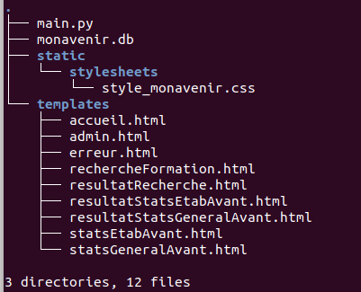
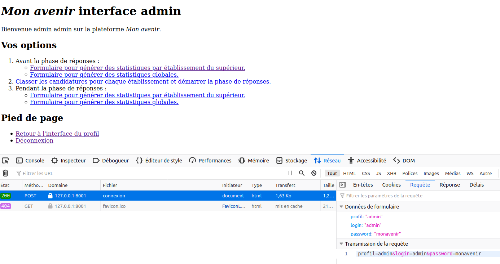
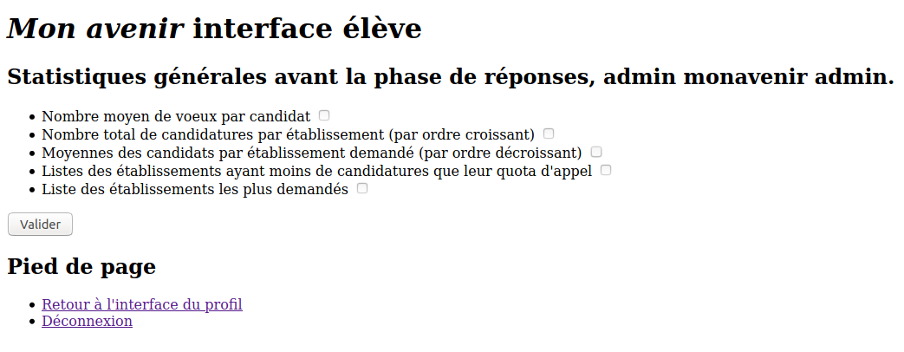
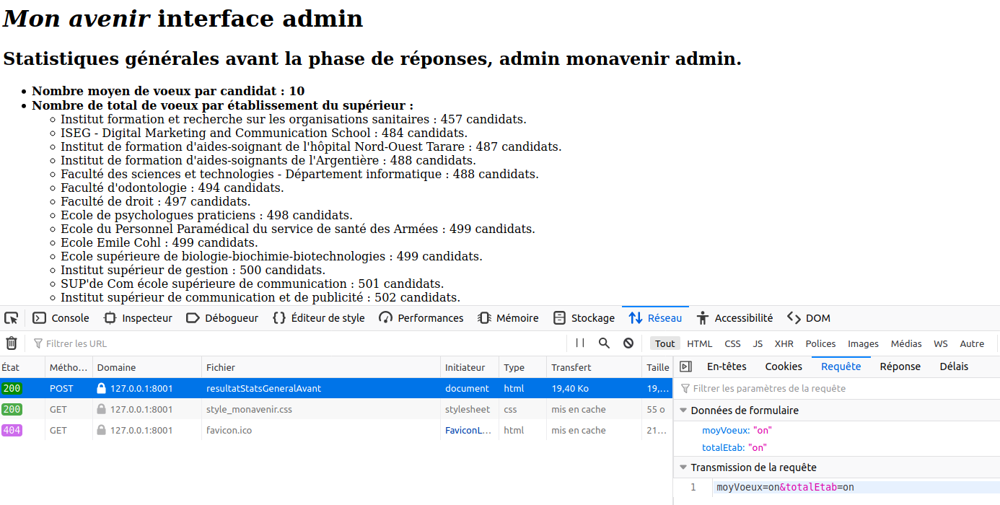

---
title : Projet "Mon avenir", Étape 6, Ateliers admin, TP noté
author : Véronique Reynaud, Brigitte Mougeot, Frédéric Junier
numbersections: true
fontsize: 11pt
geometry:
- top=20mm
- left=20mm
- right=20mm
- heightrounded    
--- 
 

[URL]: https://developer.mozilla.org/fr/docs/Glossaire/URL

[HTTP]: https://developer.mozilla.org/fr/docs/Glossaire/HTTP

[HTML]: https://developer.mozilla.org/fr/docs/Glossaire/HTML

[CSS]: https://developer.mozilla.org/fr/docs/Glossaire/CSS

[SQL]: https://www.w3schools.com/sql/

[HTTPS]: https://developer.mozilla.org/fr/docs/Glossaire/https

[TCP]: https://developer.mozilla.org/fr/docs/Glossaire/TCP

[Python]: https://docs.python.org/3.7/library/cgi.html

[POST]: https://developer.mozilla.org/fr/docs/Web/HTTP/M%C3%A9thode/POST

[GET]: https://developer.mozilla.org/fr/docs/Web/HTTP/M%C3%A9thode/GET

[Sqlite]: https://www.sqlitetutorial.net/

[Flask]: https://flask.palletsprojects.com/en/1.1.x/

[Framework]: https://fr.wikipedia.org/wiki/Framework

[MVC]: https://developer.mozilla.org/fr/docs/Glossaire/MVC

[Jinja]: https://jinja.palletsprojects.com/en/2.11.x/

[Thonny]: https://thonny.org/

[Spyder]: https://www.spyder-ide.org/

[Notepad++]: https://notepad-plus-plus.org/

[sqlite3]: https://docs.python.org/3/library/sqlite3.html

[sqlitebrowser]: ]https://sqlitebrowser.org/

[Netscape]: https://fr.wikipedia.org/wiki/Netscape_Navigator

Pour commencer, il faut récupérer l'archive [materiel.zip](./materiel.zip) puis l'extraire. Dans le répertoire créé on doit avoir l'arborescence ci-dessous  :

{width=25%}\

 

Dans chaque  atelier `admin`, vous devez   répondre à un cahier des charges, en complétant pour chaque fonctionnalité demandée  :

* un formulaire [HTML][HTML] dans le dossier _templates_ 
* une fonction __contrôleur de route__ dans le script Python `main.py` en vous aidant des activités réalisées à l'étape 4
* une page [HTML][HTML] retournée par la fonction __contrôleur de route__ et placée dans le répertoire `templates`.

Lancer l'application web en exécutant le fichier `main.py` et se connecter avec le profil `admin` et le compte d'identifiants `(login, password) = (admin, monavenir)`. On arrive alors sur l'interface d'accueil du profil.

\

# Atelier `admin` n°1 

>__Cahier des charges :__

* Créer un fichier Libre-Office  `compte-rendu.odt` à la racine du répertoire `materiel`.  
* Compléter le formulaire dans le fichier `statsEtabAvant.html` du répertoire  `templates`  afin qu'il s'affiche comme ci-dessous lorsqu'on clique sur  le lien `Formulaire pour générer des statistiques par établissement du supérieur.`  de l'interface `admin`.
  
~~~html

 <form action="/resultatStatsEtabAvant" method="post">                    

                <ul>
                    <li> <a href="/rechercheFormation">Recherche d'un établissement</a></li>
                    <li><label for='idSuperieur'>Identifiant de l'établissement : </label>
                        <input type='text' id='idSuperieur' name='idSuperieur' required></li>
                
                    <li><label for="total">Nombre total de candidatures pour l'établissement </label><input type="checkbox" id="total" name="total"
                        unchecked></li>
                    <!--  TO DO , à compléter       -->    
                </ul>
                    
                <input type="submit" value="Valider"/>
</form>   

~~~

\

* Préciser dans le fichier `compte-rendu.odt` les étapes successives entre le clic sur le lien  `Formulaire pour générer des statistiques par établissement du supérieur.` et l'affichage de `resultatStatsEtabAvant.html` dans le navigateur.

\

* Compléter les  cinq fonctions de requêtes  dans le __contrôleur de route__   `resultatStatsEtabAvant` du script `main.py` afin que le clic sur le bouton `Envoyer` du formulaire dans `statsEtabAvant.html` permette l'affichage des statistiques sélectionnées dans le formulaire.

* Répondre dans le fichier `compte-rendu.odt`.
Que se passe-t-il si on clique sur les liens `Classer les candidatures pour chaque établissement et démarrer la phase de réponses.`,  `Formulaire pour générer des statistiques par établissement du supérieur.` ou `Formulaire pour générer des statistiques globales.` ? 
Inspecter le fichier `main.py` pour expliquer ces comportements. Que pourriez-vous faire pour compléter cette application Web ?

~~~python
#controleur de route / URL
@app.route('/resultatStatsEtabAvant', methods = ['POST'])
def resultatStatsEtabAvant():
    "Controleur de la route '/resultatStatsEtabAvant' "

    def requeteNomEtab(conn, cur, idSuperieur):
        ##### TO DO  requete SQL pour retrouver l'attribut nom d'un 
        ##### établissement du supérieur à partir de son identifiant idSuperieur
        requete = """ """
        return cur.fetchone()['nom']
 

    def requeteTotalCandidature(conn, cur, idSuperieur):
        ##### TO DO  requete SQL pour retrouver le nombre total de candidatures pour l'établissement
        ##### établissement du supérieur à partir de son identifiant idSuperieur
        requete = """ """
        return int(cur.fetchone()['total'])

    def requeteSeuilAdmis(conn, cur, idSuperieur):
        ##### TO DO  requete SQL pour calculer la moyenne du dernier admis de la liste d'appel 
        ##### renommage indispensable de cette moyenne avec le nom  'seuil'
        ##### Pour obtenir le nombre d'admis dans la liste d'appel :
        ##### "SELECT nbAdmis FROM superieur WHERE idSuperieur = ... "
        requete = """ """
        cur.execute(requete, (idSuperieur,idSuperieur))
        return float(cur.fetchone()['seuil'])
     

    def requeteSeuilAttente(conn, cur, idSuperieur):
        ##### TO DO  requete SQL pour calculer la moyenne du dernier en attente dans la liste d'appel
        ##### renommage indispensable de cette moyenne avec le nom  'seuil' 
        ##### Pour obtenir le nombre total (admis + en attente) dans la liste d'appel :
        ##### "SELECT nbAppel FROM superieur WHERE idSuperieur = ... ;"
        requete = """        """
        cur.execute(requete, (idSuperieur,idSuperieur))
        return float(cur.fetchone()['seuil'])
    
      
    def requeteListeCandidatureLycee(conn, cur, idSuperieur):
        ##### TO DO  requete SQL pour déterminer le nombre de candidatures 
        ##### pour un établissement du supérieur et par lycée 
        ##### renommage indispensable : nb pour le nombre et nom pour le nom du lycée 
        requete = """     """
        cur.execute(requete, (idSuperieur,))
        return cur.fetchall()

    #analyse du formulaire
    if request.method == 'POST':   
        #ouverture du formulaire
        result = request.form
        idSuperieur = result['idSuperieur']
        #ouverture de la BDD
        conn = sqlite3.connect('monavenir.db')  
        conn.row_factory =  sqlite3.Row  #pour récupérer les lignes sous forme de dictionnaire           
        cur = conn.cursor()
        #requete sur le nom de l'établissement
        nom = requeteNomEtab(conn, cur, idSuperieur)
        #initialisation du dictionnaire de statistiques
        stats = dict()
        stats['nom'] = nom
        #on peuple stats avec les résultats des requetes, une  par paramètre transmis par le formulaire
        if 'total' in result:            
            stats['total'] = requeteTotalCandidature(conn, cur, idSuperieur)
        if 'seuilAdmis'  in result:
            stats['seuilAdmis'] = requeteSeuilAdmis(conn, cur, idSuperieur)
        if 'seuilAttente'  in result:            
            stats['seuilAttente'] = requeteSeuilAttente(conn, cur, idSuperieur)
        if 'candidLycee'  in result:
            stats['candidLycee'] = requeteListeCandidatureLycee(conn, cur, idSuperieur)
        #fermeture de la BDD
        cur.close()
        conn.close()
        #renvoi du template
        return render_template("resultatStatsEtabAvant.html", stats = stats)
~~~

# Atelier `admin` n°2 

>__Cahier des charges :__

* Créer un fichier Libre-Office  `compte-rendu.odt` à la racine du répertoire `materiel`.
* Compléter le formulaire dans le fichier `statsGeneralAvant.html` du répertoire  `templates`  afin qu'il s'affiche comme ci-dessous lorsqu'on clique sur  le lien `Formulaire pour générer des statistiques globales.`  de l'interface `admin`.

~~~html
  <form action="/resultatStatsGeneralAvant" method="post">
            
            <ul>
                <li><label for="moyVoeux">Nombre moyen de voeux par candidat </label>
                    <input type="checkbox" id="moyVoeux" name="moyVoeux"  unchecked>
                </li>

                <!--  TO DO , à compléter       -->   
                
                <li><label for="maxCandid">Liste des établissements les plus demandés </label>
                    <input type="checkbox" id="maxCandid" name="maxCandid"  unchecked>
                </li>          
               
            </ul>
                
            <input type="submit" value="Valider"/>
    </form>
~~~

\

* Préciser dans le fichier `compte-rendu.odt` les étapes successives entre le clic sur le lien  `Formulaire pour générer des statistiques globales.`  et l'affichage de `resultatStatsGeneralAvant.html` dans le navigateur.

\

* Compléter les  cinq fonctions de requêtes  dans le __contrôleur de route__   `resultatStatsEtabAvant` du script `main.py` afin que le clic sur le bouton `Envoyer` du formulaire dans `statsEtabAvant.html` permette l'affichage des statistiques sélectionnées dans le formulaire.

* Répondre dans le fichier `compte-rendu.odt`.
Que se passe-t-il si on clique sur les liens `Classer les candidatures pour chaque établissement et démarrer la phase de réponses.`,  `Formulaire pour générer des statistiques par établissement du supérieur.` ou `Formulaire pour générer des statistiques globales.` ? 
Inspecter le fichier `main.py` pour expliquer ces comportements. Que pourriez-vous faire pour compléter cette application Web ?

~~~python
#controleur de route / URL
@app.route('/resultatStatsGeneralAvant', methods = ['POST'])
def resultatStatsGeneralAvant():
    "Controleur de la route '/resultatStatsGeneralAvant' "

    def requeteNombreCandidatureParEtab(conn, cur):
        ##### TO DO  requete SQL pour déterminer le nombre de candidatures par établissement
        ##### Renommage obligatoire de ce nombre avec le nom 'nb'
        requete = """ """
        cur.execute(requete)
        return cur.fetchall()

    def requeteMoyParEtab(conn, cur):
        ##### TO DO  requete SQL pour déterminer le nombre de candidatures par établissement
        ##### Renommage obligatoire du nom de l'établissement en 'nomEtab'
        ##### Renommage obligatoire de la moyenne en 'moyEtab'
        requete = """   """
        cur.execute(requete)
        return cur.fetchall()

    def requeteNbMoyenCandidatures(conn, cur):
        ##### TO DO  requete SQL pour déterminer le nombre moyen  de candidatures par élève
        ##### Renommage obligatoire de la moyenne  en 'moyVoeux'
        requete = """  """
        cur.execute(requete)
        return int(cur.fetchone()['moyVoeux'])

    
    def requeteListeEtabMaxCandidatures(conn, cur):
        ##### TO DO  requete SQL pour déterminer la liste des établissements 
        ##### avec le nombre maximal de candidatures  
        requete = """   """        
        cur.execute(requete)
        return cur.fetchall()
  

    #analyse du formulaire
    if request.method == 'POST':   
        #ouverture du formulaire
        result = request.form
        #ouverture de la BDD
        conn = sqlite3.connect('monavenir.db')  
        conn.row_factory =  sqlite3.Row  #pour récupérer les lignes sous forme de dictionnaire           
        cur = conn.cursor()
        #initialisation du dictionnaire conteneur de stats
        stats = dict()
        if 'totalEtab' in result:            
            stats['totalEtab'] = requeteNombreCandidatureParEtab(conn, cur)
        if 'sousAppel'  in result:            
            stats['sousAppel'] = requeteEtabAvecSousAppel(conn, cur)
        if 'moyEtab'  in result:            
            stats['moyEtab'] = requeteMoyParEtab(conn, cur)
        if 'moyVoeux' in result:            
            stats['moyVoeux'] = requeteNbMoyenCandidatures(conn, cur)    
        if 'maxCandid'  in result:            
            stats['maxCandid'] = requeteListeEtabMaxCandidatures(conn, cur)
        #fermeture de la BDD
        cur.close()
        conn.close()
        return render_template('resultatStatsGeneralAvant.html', stats = stats)
~~~
