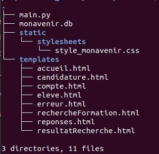
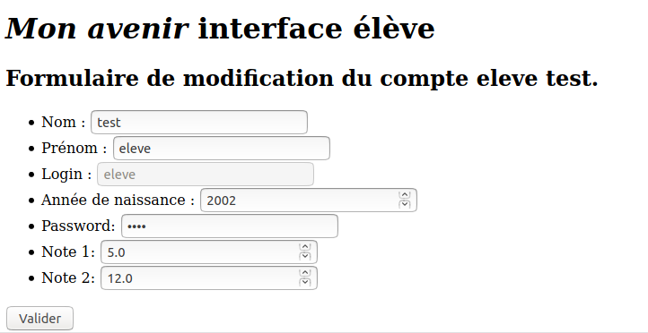
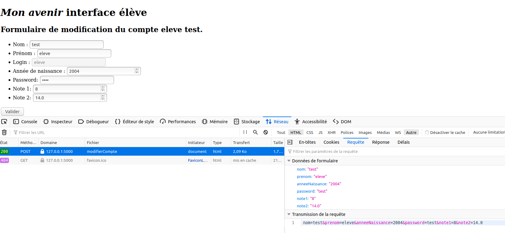
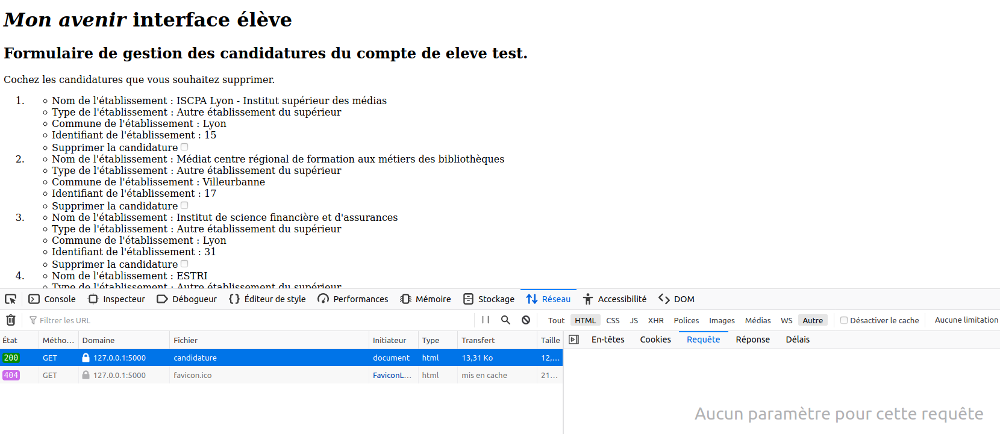
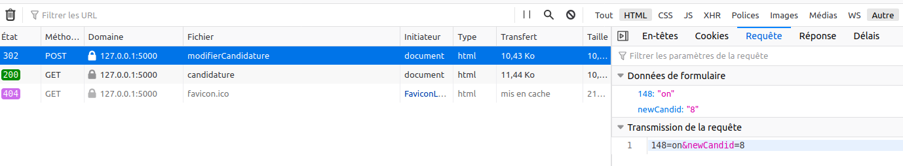
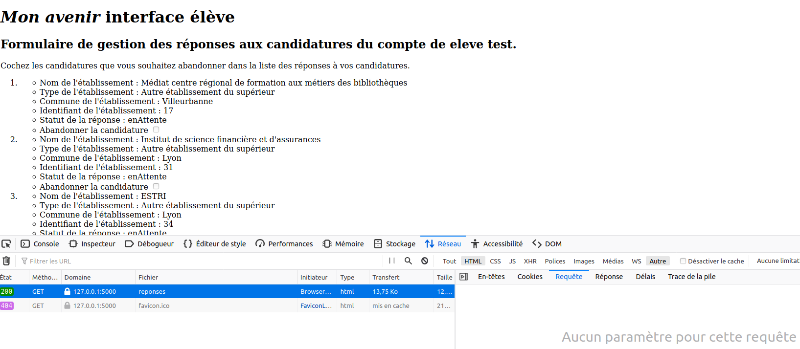
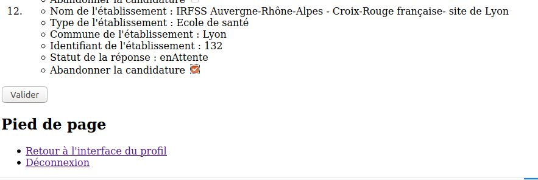

---
title : Projet "Mon avenir", Étape 6, Ateliers élèves, TP noté
author : Véronique Reynaud, Brigitte Mougeot, Frédéric Junier
numbersections: true
fontsize: 11pt
geometry:
- top=20mm
- left=20mm
- right=20mm
- heightrounded    
--- 
 
 

[URL]: https://developer.mozilla.org/fr/docs/Glossaire/URL

[HTTP]: https://developer.mozilla.org/fr/docs/Glossaire/HTTP

[HTML]: https://developer.mozilla.org/fr/docs/Glossaire/HTML

[CSS]: https://developer.mozilla.org/fr/docs/Glossaire/CSS

[SQL]: https://www.w3schools.com/sql/

[HTTPS]: https://developer.mozilla.org/fr/docs/Glossaire/https

[TCP]: https://developer.mozilla.org/fr/docs/Glossaire/TCP

[Python]: https://docs.python.org/3.7/library/cgi.html

[POST]: https://developer.mozilla.org/fr/docs/Web/HTTP/M%C3%A9thode/POST

[GET]: https://developer.mozilla.org/fr/docs/Web/HTTP/M%C3%A9thode/GET

[Sqlite]: https://www.sqlitetutorial.net/

[Flask]: https://flask.palletsprojects.com/en/1.1.x/

[Framework]: https://fr.wikipedia.org/wiki/Framework

[MVC]: https://developer.mozilla.org/fr/docs/Glossaire/MVC

[Jinja]: https://jinja.palletsprojects.com/en/2.11.x/

[Thonny]: https://thonny.org/

[Spyder]: https://www.spyder-ide.org/

[Notepad++]: https://notepad-plus-plus.org/

[sqlite3]: https://docs.python.org/3/library/sqlite3.html

[sqlitebrowser]: ]https://sqlitebrowser.org/

[Netscape]: https://fr.wikipedia.org/wiki/Netscape_Navigator

Pour commencer, il faut récupérer l'archive [materiel.zip](./materiel.zip) puis l'extraire. Dans le répertoire créé on doit avoir l'arborescence ci-dessous  :

{width=25%}\

Dans chaque  atelier `élève`, vous devez  répondre à un cahier des charges, en complétant pour chaque fonctionnalité demandée  :

* un formulaire [HTML][HTML] dans le dossier _templates_ 
* une fonction __contrôleur de route__ dans le script Python `main.py` en vous aidant des activités réalisées à l'étape 4
* une page [HTML][HTML] retournée par la fonction __contrôleur de route__ et placée dans le répertoire `templates`.

Lancer l'application web en exécutant  le fichier `main.py` et se connecter avec le profil `élève` et le compte d'identifiants `(login, password) = (eleve, test)`. On arrive alors sur l'interface d'accueil du profil.

\

# Atelier `élève` n°1 

>__Cahier des charges :__

* Créer un fichier Libre-Office  `compte-rendu.odt` à la racine du répertoire `materiel`.  
* Compléter le formulaire dans le fichier `compte.html` du répertoire  `templates`  afin qu'il s'affiche comme ci-dessous lorsqu'on clique sur  le lien `Consulter/Modifier les paramètres de son compte`  de l'interface élève. Les paramètres du formulaire sont les attributs  récupérés lors de la connexion dans  `session['user']` :  `login`, `anneeNaissance`, `note1`, `note2`.
  
~~~html

<form action="/modifierCompte" method="post">
            <ul>
                <li><label for='nom'>Nom : </label> <input type='text' id='nom' name='nom' value="{{session['user']['nom']}}"></li>
                <li><label for='prenom'>Prénom : </label> <input type='text' id='prenom' name='prenom' value="{{session['user']['prenom']}}"></li>
                <!--   TO DO  : à compléter                     -->
            </ul>
                
            <input type="submit" value="Valider"/>
</form>

~~~

* Préciser dans le fichier `compte-rendu.odt` les étapes successives entre le clic sur le lien  `Consulter/Modifier les paramètres de son compte` et l'affichage de `compte.html` dans le navigateur.

\

* Compléter la fonction `requeteMajCompte` dans le __contrôleur de route__   `modifierCompte` du script `main.py` afin que le clic sur le bouton `Envoyer` du formulaire dans `compte.html` permette la mise à jour des paramètres du compte.

\

~~~python
controleur de route / URL
@app.route('/modifierCompte', methods = ['POST'])
def modifierCompte():
    "Controleur de la route '/modifierCompte' "

    def requeteMajCompte(conn, cur, result, idEleve):
        for name, value in result.items(): #pour chaque champ du formulaire
            if result[name]:  #si l'attribut/champ du formulaire a été modifié
                #on met à jour la table eleve avec la nouvelle valeur
                ### TO DO requête SQL à compléter
                requete = "".format(name)
                cur.execute(requete, (value, idEleve))
                #on met à jour le dictionnaire du cookie de session voir https://flask.palletsprojects.com/en/1.1.x/api/#sessions
                session['user'][name] = value 
                session.modified = True
        
    #analyse du formulaire
    if request.method == 'POST':
        #ouverture du formulaire
        result = request.form
        #ouverture de connexion à la BDD
        conn = sqlite3.connect('monavenir.db')      
        cur = conn.cursor()
        #on récupère l'idEleve dans le dictionnaire de session
        idEleve = session['user']['idEleve'] 
        requeteMajCompte(conn, cur, result, idEleve)
        #enregistrement des modifications dans la BDD
        conn.commit()
        #fermeture de connexion à la BDD
        cur.close()
        conn.close()
    return render_template("compte.html")
~~~

* Compléter la fonction `requeteListeCandidature` dans le  __contrôleur de route__  `candidature` de `main.py` afin qu'elle détermine la liste des candidatures de l'élève. Cette liste est nécessaire à l'affichage du formulaire de gestion des candidatures avant la phase de réponses lorsqu'on clique  sur `Gérer ses candidatures : afficher, supprimer, ajouter.` dans l'interface élève.

~~~python
#controleur de route / URL
@app.route('/candidature')
def candidature():
    "Controleur de la route '/candidature' "

        def requeteListeCandidature(conn, cur, idEleve):
        ##### TO DO  requete SQL à compléter 
        requete = """  """
        cur.execute(requete, (idEleve,))
        return cur.fetchall()
        
        
 
    #ouverture de connexion à la BDD
    conn = sqlite3.connect('monavenir.db')  
    conn.row_factory =  sqlite3.Row  #pour récupérer les lignes sous forme de dictionnaire         
    cur = conn.cursor()
    #on récupère l'idEleve dans le cookie de session
    idEleve = session['user']['idEleve'] 
    #requete
    liste_candidature = requeteListeCandidature(conn, cur, idEleve)
    #mise à jour du dictionnaire du cookie de session pour récupérer liste_candidature dans modifierCandidature voir https://flask.palletsprojects.com/en/1.1.x/api/#sessions
    session['liste_candidature'] = [dict(candidature) for candidature in liste_candidature]
    session.modified = True
    #fermeture de connexion à la BDD
    cur.close()
    conn.close()
    #renvoi du template
    return render_template("candidature.html", MAX_CANDIDATURE = MAX_CANDIDATURE)
~~~
* Préciser dans le fichier `compte-rendu.odt` les étapes successives entre le clic sur le lien  `Gérer ses candidatures : afficher, supprimer, ajouter.` et l'affichage de `candidature.html` dans le navigateur.

* Compléter ensuite  le fichier `candidature.html` du répertoire  `templates`  afin que le formulaire  s'affiche comme ci-dessous lorsqu'on clique sur  le lien `Gérer ses candidatures : afficher, supprimer, ajouter.`  de l'interface élève.  La première image montre le haut du formulaire avec la liste des candidatures. On supprime une candidature en la cochant. La seconde image montre le bas avec la possibilité de saisir une nouvelle candidature à l'aide de son identifiant récupéré par le formulaire de recherche de formation `Rechercher un établissement du supérieur`.
  
~~~html
<form action="/modifierCandidature" method="post">
            <ol>
                
                <li> 
                    <ul>                  
                    <li> Nom de l'établissement : {{candidature['nom']}} </li>
                    <li> Type de l'établissement : {{candidature['type']}}  </li>
                    <!---  TO DO à compléter  -->
                </ul>
                </li>
                
                <li><label for="newCandid">Nouvelle candidature</label>  <input type="number" name="newCandid" id="newCandid"></li>
            </ol>                
            <input type="submit" value="Valider"/>
</form>
~~~

\

\

* Compléter enfin les fonctions `requeteListeCandidatureApresSuppression` et `requeteTraitementNouvelleCandidature` dans le __contrôleur de route__   `modifierCandidature` du script `main.py` afin que le clic sur le bouton `Envoyer` du formulaire dans `candidature.html` permette la mise à jour des candidatures.

~~~python
#controleur de route / URL
@app.route('/modifierCandidature', methods = ['POST'])
def modifierCandidature():
    "Controleur de la route '/modifierCandidature' "

    def requeteListeCandidatureApresSuppression(conn, cur, result, idEleve):
        """Supprime les candidatures abandonnées
        et retourne la liste des identifiants des établissements demandés par l'élève
        """
        #recupération de données dans le dictionnaire de session
        liste_idSuperieur = [candidature['idSuperieur']  for candidature in session['liste_candidature'] ]
        for name, value in result.items():
            if name != 'newCandid' and value == 'on': #en fait les cases à cocher non cochées ne sont pas transmises voir https://developer.mozilla.org/fr/docs/Web/HTML/Element/input/checkbox
                ##### TO DO  requete SQL à compléter pour mettre à jour liste_idSuperieur                cur.execute("DELETE FROM candidature WHERE idSuperieur = ? and idEleve = ? ;", (name, session['user']['idEleve']))
                requete = " "
                cur.execute(requete, (name, session['user']['idEleve']))
                liste_idSuperieur.remove(int(name))
        return liste_idSuperieur
        
        liste_idSuperieur = [candidature['idSuperieur']  for candidature in session['liste_candidature'] ]
       
        return liste_idSuperieur
   
    def requeteTraitementNouvelleCandidature(conn, cur, result, liste_idSuperieur):
        #nouvelle candidature avec dépassement du nombre de maximal de candidatures MAX_CANDIDATURE
        #message d'erreur d'alerte transmis à la page retournée
        # voir https://flask.palletsprojects.com/en/1.1.x/patterns/flashing/ 
        if len(liste_idSuperieur) == MAX_CANDIDATURE and result['newCandid']:
            flash('Nombre maximal de voeux atteint !')  
        #sinon traitement de la nouvelle candidature
        elif result['newCandid']:
            idSuperieur = int(result['newCandid']) #récupération de l'identifiant de la formation du supérieur saisi dans le formulaire
            ##### TO DO  traitement avec requete SQL   

    #analyse du formulaire
    if request.method == 'POST':  
        #ouverture du formulaire      
        result = request.form
        #connexion à la BDD
        conn = sqlite3.connect('monavenir.db')           
        cur = conn.cursor()
        #récupération de idEleve dans le dictionnaire de session
        idEleve = session['user']['idEleve']
        #Mise à jour de la liste des candidatures
        liste_idSuperieur = requeteListeCandidatureApresSuppression(conn, cur, result, idEleve)
        requeteTraitementNouvelleCandidature(conn, cur, result, liste_idSuperieur)
        #enregistrement des modifications dans la BDD
        conn.commit()
        #fermeture de la base de données 
        cur.close()
        conn.close()
    #renvoi du template (redirection par le nom de la fonction controleur de route)
    return redirect(url_for('candidature')) #redirection vers l'URL gérée par candidature 

~~~

# Atelier `élève` n°2  

>__Cahier des charges :__

* Créer un fichier Libre-Office  `compte-rendu.odt` à la racine du répertoire `materiel`.
* Compléter la fonction `requeteListeReponsesCandidatures` dans le  __contrôleur de route__  `reponses` de `main.py` afin qu'elle détermine la liste des candidatures de l'élève. Cette liste est nécessaire à l'affichage du formulaire de gestion des candidatures avant la phase de réponses lorsqu'on clique  sur `Gérer les réponses à ses candidatures : afficher, abandonner.` dans l'interface `élève`.

~~~python
#controleur de route / URL
@app.route('/reponses')
def reponses():
    "Controleur de la route '/reponses' "

    def requeteListeReponsesCandidatures(conn, cur, idEleve):
        #renommage nécessaire pour superieur.nom en nomEtab 
        #pour affichage dans reponses.html
        ##### TO DO  requete SQL à compléter et résultat à retourner
        requete = """  """
        cur.execute(requete, (idEleve,))
        return  cur.fetchall()
        
    #connexion à la BDD
    conn = sqlite3.connect('monavenir.db')  
    conn.row_factory =  sqlite3.Row  #pour récupérer les lignes sous forme de dictionnaire         
    cur = conn.cursor()
    idEleve = session['user']['idEleve'] #on récupère l'idEleve dans le cookie de session
    #requete
    liste_reponses = requeteListeReponsesCandidatures(conn, cur, idEleve)
    #mise à jour du dictionnaire du cookie de session 
    session['liste_reponses'] = [dict(reponse) for reponse in liste_reponses]
    #fermeture de la base de données 
    cur.close()
    conn.close()
    #renvoi du template
    return render_template("reponses.html")
~~~

* Préciser dans le fichier `compte-rendu.odt` les étapes successives entre le clic sur le lien  `Gérer les réponses à ses candidatures : afficher, abandonner.` et l'affichage de `reponses.html` dans le navigateur.

* Compléter ensuite  le fichier `reponses.html` du répertoire  `templates`  afin que le formulaire  s'affiche comme ci-dessous lorsqu'on clique sur  le lien `Gérer les réponses à ses candidatures : afficher, abandonner.`  de l'interface élève.  La première image montre le haut du formulaire avec la liste des candidatures. On supprime une candidature en la cochant. La seconde image montre le bas avec le bouton d'envoi du formulaire.

\

\

* Compléter enfin les fonctions `requeteAbandonCandidature` et `requeteMajListeAppel` dans le __contrôleur de route__   `modifierReponses` du script `main.py` afin que le clic sur le bouton `Envoyer` du formulaire dans `reponses.html` permette la mise à jour des réponses. Préciser dans `compte-rendu.odt` comment les valeurs `idSuperieur`, `idEleve` et  `statut` sont transmises par le formulaire.

~~~python
#controleur de route / URL
@app.route('/modifierReponses', methods = ['POST'])
def modifierReponses():
    "Controleur de la route '/modifierReponses' "

    def requeteAbandonCandidature(conn, cur, result, idSuperieur, idEleve):
        ##### TO DO  requete SQL à exécuter pour mettre à jour l'abandon de candidature
        requete = """  """
        #on enregistre le changement
        cur.execute(requete, (int(idSuperieur), int(idEleve)))
        conn.commit()

    def requeteMajListeAppel(conn, cur,  idSuperieur, idEleve):
        ##### TO DO  requete SQL à compléter  pour récupèrer les quotas de l'établissement concerné
        requete0 = ""
        cur.execute(requete0, (idSuperieur,))
        quotas = cur.fetchone()
        nbAdmis = int(quotas[0])
        nbAppel = int(quotas[1])
        ##### TO DO requête SQL à compléter
        #on récupère l'identifiant du premier de la liste d'attente et on change son statut
        requete1 = """ """
        cur.execute(requete1, (idSuperieur,))
        idAttente = cur.fetchone()[0]
        ##### TO DO requête SQL à compléter
        #on met à jour le statut de la candidature de cet élève
        requete2 = """  """
        cur.execute(requete2, (idSuperieur,idAttente))
        #on enregistre
        conn.commit()    

    #analyse du formulaire
    if request.method == 'POST':        
        #ouverture du formulaire
        result = request.form
        #connexion à la BDD
        conn = sqlite3.connect('monavenir.db')           
        cur = conn.cursor()
        #Modification du staut d'une candidature (abandon)
        for name, value in result.items():
            #en fait les cases à cocher non cochées ne sont pas transmises voir https://developer.mozilla.org/fr/docs/Web/HTML/Element/input/checkbox
            #récupération des informations stockées dans les paramètres de chaque candidature du formulaire
            idSuperieur, idEleve, statut = name.rstrip(')').lstrip('(').split(',')
            #mise à jour de la base avec le statut 'abandonne' pour les candidatures de cet élève
            requeteAbandonCandidature(conn, cur, result, idSuperieur, idEleve)
            #si pour cette candidature le statut de la candidature de l'élève était 'admis'
            if statut == 'admis':
                requeteMajListeAppel(conn, cur,  idSuperieur, idEleve)

        #fermeture de la BDD
        cur.close()
        conn.close()
        #renvoi du template
        return redirect(url_for('reponses')) #redirection vers l'URL gérée par reponses

~~~
