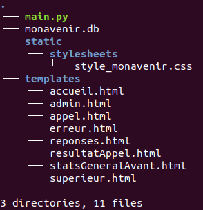
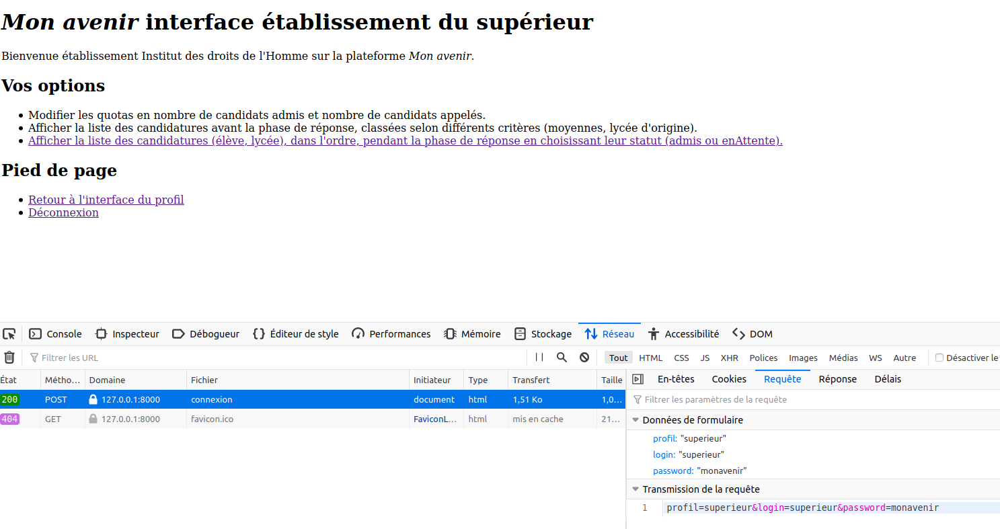
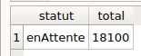
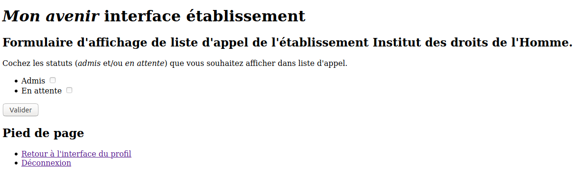
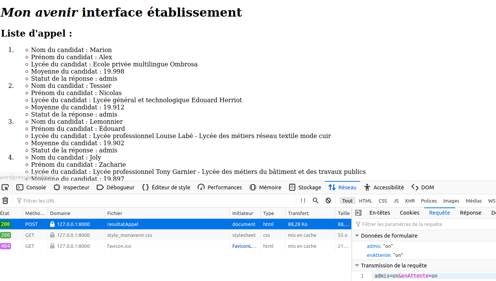
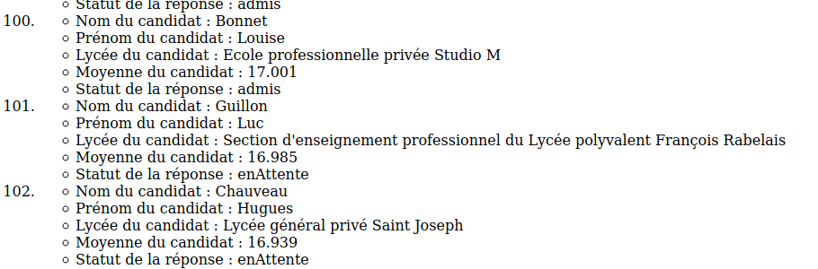

---
title : Projet "Mon avenir", Étape 6, Ateliers admin, TP noté
author : Véronique Reynaud, Brigitte Mougeot, Frédéric Junier
numbersections: true
fontsize: 11pt
geometry:
- top=20mm
- left=20mm
- right=20mm
- heightrounded    
--- 
 

[URL]: https://developer.mozilla.org/fr/docs/Glossaire/URL

[HTTP]: https://developer.mozilla.org/fr/docs/Glossaire/HTTP

[HTML]: https://developer.mozilla.org/fr/docs/Glossaire/HTML

[CSS]: https://developer.mozilla.org/fr/docs/Glossaire/CSS

[SQL]: https://www.w3schools.com/sql/

[HTTPS]: https://developer.mozilla.org/fr/docs/Glossaire/https

[TCP]: https://developer.mozilla.org/fr/docs/Glossaire/TCP

[Python]: https://docs.python.org/3.7/library/cgi.html

[POST]: https://developer.mozilla.org/fr/docs/Web/HTTP/M%C3%A9thode/POST

[GET]: https://developer.mozilla.org/fr/docs/Web/HTTP/M%C3%A9thode/GET

[Sqlite]: https://www.sqlitetutorial.net/

[Flask]: https://flask.palletsprojects.com/en/1.1.x/

[Framework]: https://fr.wikipedia.org/wiki/Framework

[MVC]: https://developer.mozilla.org/fr/docs/Glossaire/MVC

[Jinja]: https://jinja.palletsprojects.com/en/2.11.x/

[Thonny]: https://thonny.org/

[Spyder]: https://www.spyder-ide.org/

[Notepad++]: https://notepad-plus-plus.org/

[sqlite3]: https://docs.python.org/3/library/sqlite3.html

[sqlitebrowser]: ]https://sqlitebrowser.org/

[Netscape]: https://fr.wikipedia.org/wiki/Netscape_Navigator

Pour commencer, il faut récupérer l'archive [materiel.zip](./materiel.zip) puis l'extraire. Dans le répertoire créé on doit avoir l'arborescence ci-dessous  :
 

{width=25%}\

Dans cet  atelier `superieur`, vous devez   répondre à un cahier des charges, en complétant pour chaque fonctionnalité demandée  :

* un formulaire [HTML][HTML] dans le dossier _templates_ 
* une fonction __contrôleur de route__ dans le script Python `main.py` en vous aidant des activités réalisées à l'étape 4
* une page [HTML][HTML] retournée par la fonction __contrôleur de route__ et placée dans le répertoire `templates`.

Lancer l'application web en exécutant le fichier `main.py` et se connecter avec le profil `admin` et le compte d'identifiants `(login, password) = (superieur, monavenir)`. On arrive alors sur l'interface d'accueil du profil.

Dans cet atelier, vous manipulerez une base dont les candidatures ont été classées.

{width=75%}\

# Atelier `superieur` n°1 

>__Cahier des charges :__

* Créer un fichier Libre-Office  `compte-rendu.odt` à la racine du répertoire `materiel`.  
* Ouvrir la base `monavenir.db` avec [sqlitebrowser][sqlitebrowser] :
  * Noter dans `compte-rendu.odt` la  requête sur la table `candidature` qui permet d'obtenir le résultat ci-dessous :

    \

  * Noter dans `compte-rendu.odt` la  requête sur la table `candidature` qui permet d'obtenir le résultat ci-dessous :

    \

* Compléter le formulaire dans le fichier `appel.html` du répertoire  `templates`  afin qu'il s'affiche comme ci-dessous lorsqu'on clique sur  le lien `Afficher la liste des candidatures (élève, lycée), dans l'ordre, pendant la phase de réponse en choisissant leur statut (admis ou enAttente).`  de l'interface `superieur`.
  
    ~~~html

    <form action="/resultatAppel" method="post">
                <ul>
                <li><label for="admis">Admis</label>    <input type="checkbox" id="admis"  name="admis"  unchecked>
                </li>  
                <!--  TO DO à compléter -->
                </li>  
            </ul>    
                <input type="submit" value="Valider"/>
    </form>

    ~~~

    \

* Préciser dans le fichier `compte-rendu.odt` les étapes successives entre le clic sur le lien `Afficher la liste des candidatures (élève, lycée), dans l'ordre, pendant la phase de réponse en choisissant leur statut (admis ou enAttente).` et l'affichage de `resultatAppel.html` dans le navigateur.

* Compléter la fonction de requête  dans le __contrôleur de route__   `resultatAppel` du script `main.py` afin que le clic sur le bouton `Envoyer` du formulaire dans `appel.html` permette l'affichage détaillée de la liste d'appel de l'établissement avec les candidats classés par ordre décroissant des moyennes.
 

* Compléter le template  `resultatAppel.html` pour que l'affichage ressemble aux images ci-dessous :

    ~~~html
    <section>
                <h2>Liste d'appel : </h2>
                <ol>
                
                <li> 
                    <ul>                  
                    <li> Nom du candidat : {{candidat['nomCandidat']}} </li>
                    <li> Prénom du candidat : {{candidat['prenomCandidat']}}  </li>
                    <!--  TO DO à compléter -->
                </ul>
                </li>
                
            </ol>

    </section> 
    ~~~

    {width=75%})\

    {width=75%}\